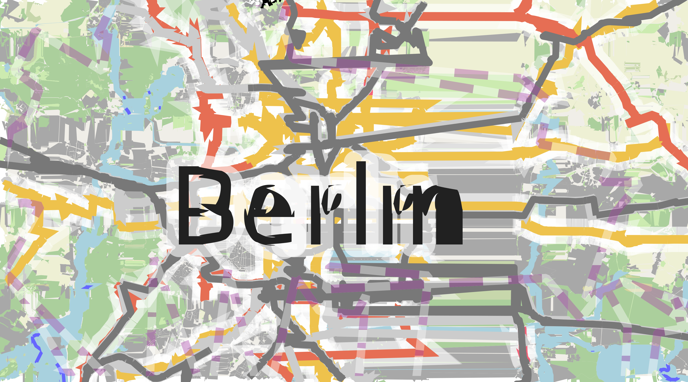
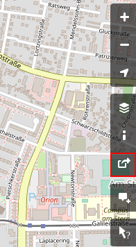
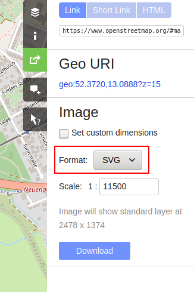
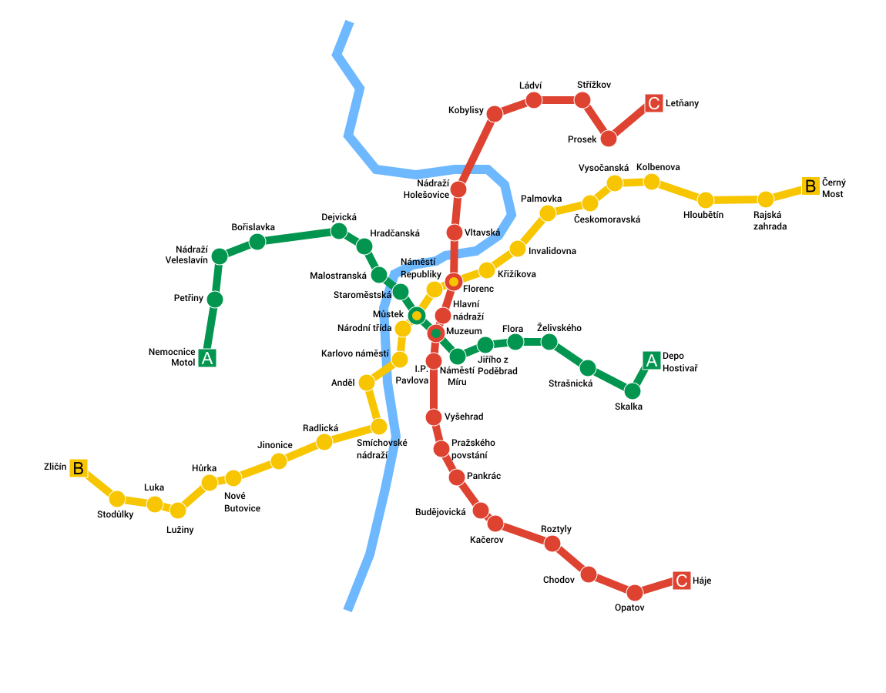
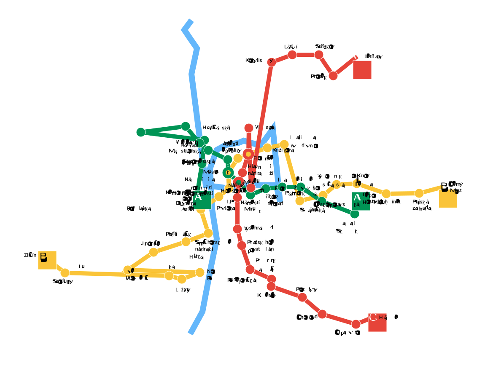
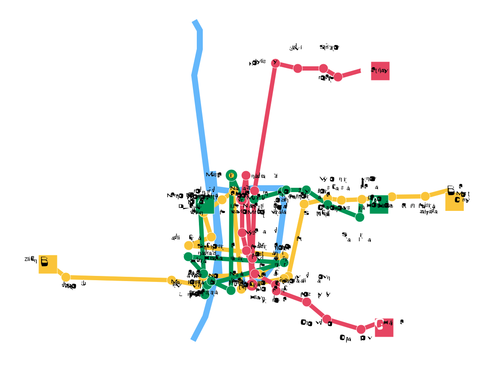

# Guide to SVG-Glitching
 
## Choose your SVG
### Use a Map
Go to [OpenStreetMap](www.openstreetmap.org) 
 
 
### Example File
Use the [Prague Metro Map](Prague_metro_plan_2015.svg) file (from wikipedia) provided.

## Open SVG in any Text Editor
Depends a bit on the Editor and Operating System. You might be able to right click the file and say "Open in Text Editor" or start the Editor, Open File and say that it should show all files (not filtering by extensions).
## Replace
Find the editor's menu for search and replace (normally it opens with Ctrl+H or is located in the search menu Ctrl+F).  
 
Replace one number with another one. I'll try 2 with 4 first. 
 
Save the file but **don't close the editor!** 
Now check the file in any program. If it doesn't open or you get an error check in another app (AI/Inkscape). 
 
If it's definitely corrupted go back to the editor and undo your last replacement step. 
Now try another combination and do your next replacement/try again.
 
And after replacing 3 with 6:
 
